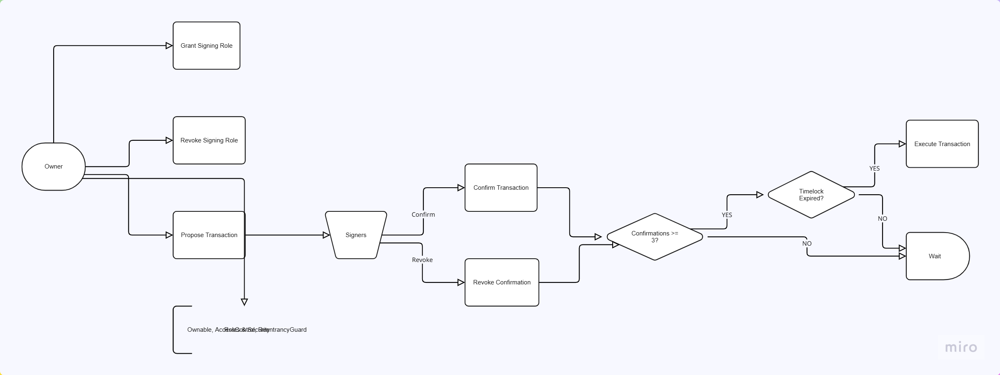

# Multi-Signature Wallet Timelock 

This project has been built as a personal mini-project, and it is a role-based, multi-signature wallet with a timelock functionality built with Open Zeppelin's Role-Based Access-Control(RBAC).

The timelock functionality kicks in with increasing amounts of ETH to be sent in a transaction.

A live 'unverified' contract address with Ethereum Sepolia testnet is available at [contract address](https://sepolia.etherscan.io/address/0x34da08fbaed3814e8c71691641ef0ad4fe0b7fde).
A Second Verified Contract address with Ethereum Sepolia testnet is available at [contract address](https://sepolia.etherscan.io/address/0xd1b5cd33bae15f16ceb28c378c77885e4563e024)

## Table of Contents

- [Multi-Signature Wallet Timelock](#multi-signature-wallet-timelock)
  - [Table of Contents](#table-of-contents)
  - [Overview](#overview)
  - [Role-Based Multi-Signature Wallets](#role-based-multi-signature-wallets)
  - [Contracts/Architecture](#contractsarchitecture)
  - [System Actors](#system-actors)
  - [OpenZeppelin Integrations](#openzeppelin-integrations)
    - [Ownable](#ownable)
    - [AccessControl](#accesscontrol)
    - [ReentrancyGuard](#reentrancyguard)
  - [Flowchart](#flowchart)
  - [Deployment and Interaction](#deployment-and-interaction)
  - [Testing](#testing)
    - [Unit Tests](#unit-tests)
      - [Unit test note](#unit-test-note)
    - [Other Tests](#other-tests)
  - [Testnet Deployments](#testnet-deployments)
    - [Eth Sepolia](#eth-sepolia)
  - [Testnet Transactions](#testnet-transactions)
    - [Grant Signing Roles](#grant-signing-roles)
    - [Propose Transaction](#propose-transaction)
    - [Confirm Transaction](#confirm-transaction)
    - [Execute Transaction](#execute-transaction)
  - [Future Developments](#future-developments)
  - [Acknowledgement](#acknowledgement)

## Overview

**Problem statement**: "Securely managing multi-signature transactions on Ethereum requires a robust mechanism to ensure consensus among multiple parties while mitigating risks such as unauthorized access, premature execution, or reentrancy attacks. Traditional multi-signature wallets may lack flexible timelock mechanisms to delay high-value transactions, increasing the risk of hasty or malicious executions."

**Solution**: The `MultiSigTimelock` contract implements a role-based multi-signature wallet with a dynamic timelock feature. It allows up to five signers, requiring at least three confirmations to execute a transaction. The timelock duration varies based on transaction value: no delay for transactions below 1 ETH, 1 day for 1-10 ETH, 2 days for 10-100 ETH, and 7 days for 100 ETH and above. This ensures higher scrutiny for larger transactions. 

The contract leverages OpenZeppelin's `Ownable`, `AccessControl`, and `ReentrancyGuard` to enforce ownership, role-based permissions, and protection against reentrancy attacks. Transactions are proposed, confirmed, and executed in a secure, transparent manner, with events emitted for tracking and getters for querying state.

## Role-Based Multi-Signature Wallets

Multi-signature (multisig) wallets enhance security by requiring multiple approvals before executing transactions on blockchain networks like Ethereum. They typically follow standards such as [ERC-1271](https://eips.ethereum.org/EIPS/eip-1271) for signature validation and integrate with modules like timelocks for delayed execution. Popular implementations, such as Gnosis Safe, are modular and permissioned, allowing customizable signer thresholds (e.g., m-of-n approvals) to prevent single-point failures. Advanced features include batched transactions via `execTransaction` and gas-efficient role management, reducing risks from key loss or compromise. See [Gnosis Safe contracts](https://github.com/safe-global/safe-contracts).

## Contracts/Architecture

The MultiSigTimelock system implements a role-based multi-signature wallet with integrated timelock delays for secure transaction management on Ethereum. The `MultiSigTimelock` contract serves as the core component, handling all aspects of transaction proposal, confirmation, revocation, and execution while enforcing security through inherited OpenZeppelin modules like `Ownable` for ownership control, `AccessControl` for role management, and `ReentrancyGuard` to prevent reentrancy attacks.

The contract owner (deployer by default) proposes transactions by specifying a recipient address, ETH value, and optional data payload. In exchange, a unique transaction ID is generated, and the transaction enters a pending state. Approved signers (up to a maximum of 5, with at least 3 required confirmations) can then confirm or revoke their approval for the transaction. The timelock delay is dynamically applied based on the transaction's value: no delay for under 1 ETH, 1 day for 1-10 ETH, 2 days for 10-100 ETH, and 7 days for 100 ETH or more. Once sufficient confirmations are met and the timelock expires, any signer can execute the transaction, transferring the specified ETH (and calling any data if provided) while emitting events for transparency. The owner also manages signer roles by granting or revoking the `SIGNING_ROLE`, ensuring only authorized accounts participate.

This architecture prioritizes security and consensus, with all logic contained in a single contract to minimize complexity and attack surfaces. See [./src/MultiSigTimelock.sol](https://github.com/Kelechikizito/multisig-wallet-foundry/blob/master/src/MultiSigTimelock.sol).

## System Actors

The primary actors in this system are the contract owner and the signers, who collectively manage and execute transactions.

**Contract Owner** deploys the contract and automatically becomes the first signer. They can propose new transactions (specifying recipient, value, and data), grant signing roles to additional accounts (up to a maximum of 5 total signers), and revoke signing roles from existing signers (except the last one to maintain functionality).

**Signers** hold the SIGNING_ROLE and include the owner plus up to 4 additional approved accounts. They can confirm proposed transactions to build the required consensus (minimum 3 confirmations), revoke their own confirmations if needed, and execute confirmed transactions once the value-based timelock period has expired.

## OpenZeppelin Integrations

OpenZeppelin libraries provide secure, audited primitives for access management and vulnerability prevention in the MultiSigTimelock contract. Ownable, AccessControl, and ReentrancyGuard are combined to handle ownership, role-based signing, and reentrancy protection, ensuring the multisig operates safely without single points of failure.

### Ownable

Ownable provides basic authorization control, designating a single owner (typically the deployer) who can manage signer roles and initiate transaction proposals.

The constructor initializes the owner with `Ownable(msg.sender)`. Administrative functions such as `grantSigningRole` and `revokeSigningRole` for adding/removing signers, and `proposeTransaction` for submitting new transactions, are restricted via the `onlyOwner` modifier.

### AccessControl

AccessControl enables granular role management, specifically through the `SIGNING_ROLE` which authorizes up to five signers to participate in transaction approvals.

The role is granted/revoked using `_grantRole` and `_revokeRole` in `grantSigningRole` and `revokeSigningRole`. Core operations like `confirmTransaction`, `revokeConfirmation`, and `executeTransaction` are protected by the `onlyRole(SIGNING_ROLE)` modifier, allowing confirmed signers to interact while enforcing the required confirmation threshold.

### ReentrancyGuard

ReentrancyGuard prevents recursive call attacks by locking functions during execution, safeguarding the contract's state during external interactions.

The `nonReentrant` modifier is applied to all external mutable functions, including `grantSigningRole`, `revokeSigningRole`, `proposeTransaction`, `confirmTransaction`, `revokeConfirmation`, and `executeTransaction`, ensuring safe handling of ETH transfers and state updates without reentrancy risks.

## Flowchart

This diagram shows a (rough) high-level overview of the entire process of the MultisigTimelock.



## Deployment and Interaction

The `MultiSigTimelock` contract should be deployed first on the desired network (e.g., Sepolia). This script deploys the contract, setting the deployer as the initial owner and first signer with the signing role.

```
forge script script/DeployMultiSigTimelock.s.sol:DeployMultiSigTimelock --broadcast --account <YOUR_FOUNDRY_KEYSTORE> --rpc-url <CHAIN_RPC_URL> --verify --etherscan-api-key <YOUR_ETHERSCAN_API_KEY> -vvvv
```

After deployment, grant signing roles to additional accounts (up to a maximum of 5 total signers). This script grants the signing role to a specified account, enabling it to confirm and execute transactions. Repeat as needed for each additional signer.

```
forge script script/GrantSigningRole.s.sol:GrantSigningRole --broadcast --account <YOUR_FOUNDRY_KEYSTORE> --rpc-url <CHAIN_RPC_URL> --verify --etherscan-api-key <YOUR_ETHERSCAN_API_KEY> -vvvv
```

To interact with the contract, first propose a transaction. This script proposes a transaction to send ETH to a recipient, with optional data for contract calls. It uses the most recently deployed `MultiSigTimelock` and requires the owner's account.

```
forge script script/Interact.s.sol:ProposeTransactionScript --broadcast --account <YOUR_FOUNDRY_KEYSTORE> --rpc-url <CHAIN_RPC_URL> --verify --etherscan-api-key <YOUR_ETHERSCAN_API_KEY> -vvvv
```

Next, confirm the proposed transaction with at least three signers (the minimum required). This script confirms the transaction using the stored transaction ID. Run it separately for each confirming account.

```
forge script script/Interact.s.sol:ConfirmTransactionScript --broadcast --account <YOUR_FOUNDRY_KEYSTORE> --rpc-url <CHAIN_RPC_URL> --verify --etherscan-api-key <YOUR_ETHERSCAN_API_KEY> -vvvv
```

Finally, execute the transaction once sufficient confirmations are obtained and any timelock has expired (based on transaction value). This script executes the transaction, transferring ETH or calling the specified data.

```
forge script script/Interact.s.sol:ExecuteTransactionScript --broadcast --account <YOUR_FOUNDRY_KEYSTORE> --rpc-url <CHAIN_RPC_URL> --verify --etherscan-api-key <YOUR_ETHERSCAN_API_KEY> -vvvv
```

## Testing

This project was built with [Foundry](https://getfoundry.sh/introduction/installation/). To run the tests, Foundry and the project's dependencies need to be installed.

```
foundryup
forge install
```

### Unit Tests

The unit tests for the MultiSigTimelock contract are written using Foundry's testing framework (`forge-std/Test.sol`). They cover core functionality including signing role management (grant/revoke), transaction lifecycle (propose, confirm, revoke, execute), timelock delays based on transaction value, receive function for ETH deposits, getter functions, and integration with deployment/interaction scripts. Tests utilize Foundry cheats like `vm.prank` for simulating different signers, `vm.deal` for funding accounts/contracts, and `vm.expectRevert` for assertion of error conditions. No mainnet forking is required, as all tests run in a local simulated environment.

The tests deploy fresh instances of `MultiSigTimelock` in `setUp()` and use helper contracts like `EthRejector` (for failed executions) and `TestTimelockDelay` (for isolated timelock logic verification). Script tests simulate real-world interactions by instantiating script contracts (e.g., `DeployMultiSigTimelock`, `GrantSigningRole`, `ProposeTransactionScript`) and calling their methods, ensuring deployment and transaction flows work end-to-end.

#### Unit test note

To run tests involving scripts (e.g., `testProposeTransactionScript`, `testConfirmTransactionScript`), which persist and retrieve `txnId` via file I/O using `vm.writeJson` and `vm.readFile`, you must enable filesystem permissions in `foundry.toml`:

```
[profile.default]
fs_permissions = [{ access = "read-write", path = "./" }]
```

This allows safe access to files like `txnId.json` during testing. Without this, file-related operations will revert.

The unit tests for the MultiSigTimelock contract can be run with:

```
forge test --match-contract MultiSigTimeLockTest
```

### Other Tests

For the full Foundry test suite (), run:

```
forge test
```

## Testnet Deployments

The MultiSigTimelock contract has been deployed on the Ethereum Sepolia testnet to verify its role-based multi-signature and timelock functionalities in a realistic blockchain environment. This allows for thorough testing of transaction proposals, confirmations, revocations, and executions under varying value-based delays (e.g., no delay for <1 ETH, up to 7 days for ≥100 ETH) without risking real assets.
 
No mock contracts were necessary, as the implementation relies on standard OpenZeppelin libraries for ownership, access control, and security.

### Eth Sepolia

MultiSigTimelock: https://sepolia.etherscan.io/address/0x34da08fbaed3814e8c71691641ef0ad4fe0b7fde#code

## Testnet Transactions

### Grant Signing Roles

grant to signer 0x93923B42Ff4BDF533634Ea71BF626C90286D27A0: (https://sepolia.etherscan.io/tx/0x5af43371ceaaacb49d8c40524ae3c298d8126c60c9c9a74a6b2b2eda776ccebd)

grant to signer 0x5D4AD28BD191107E582E56E47D7407BD5F111D8B: (https://sepolia.etherscan.io/tx/0x8cf0445cd885eb37ac1c7996639d033a003bb95d9f7014903478f00ef8990871)

grant to signer 0x86F44Aa771F0Ad42A037Eff70C859Bb1B86C188A: (https://sepolia.etherscan.io/tx/0x8f9bd3d606b213343d79e48ce6594ddc9f19d66caf1b719b1c08ed3281ac9da8)

grant to signer 0x5375Bb27ABeC8D0F69D035C58306936aA9991182: (https://sepolia.etherscan.io/tx/0x4eb51e6bc205b2da5bebac10e8aea6433f159fb45ef1d4b78d86110e7ecbaa59)

### Propose Transaction

propose tx to send 0.005 ETH to 0x93923B42Ff4BDF533634Ea71BF626C90286D27A0 (txId 0): (https://sepolia.etherscan.io/tx/0xd9c87d54558ee6336bcde6e390fa4c6ece903c96a33f045d8002740e64473850)

### Confirm Transaction

confirmation by owner for txId 0: (https://sepolia.etherscan.io/tx/0x0d7296e393a36aad7ae1ba42bf338bf8efa24524bb2a008536aa4ca7de2c059a)

confirmation by signer 0x93923B42Ff4BDF533634Ea71BF626C90286D27A0 for txId 0: (https://sepolia.etherscan.io/tx/0x93adf4a3c3b52bab81095fc8ff2681db700d51c8e48b6551cecedf86fbb00b09)

confirmation by signer 0x5D4AD28BD191107E582E56E47D7407BD5F111D8B for txId 0: (https://sepolia.etherscan.io/tx/0xc1580964a0e40b19a819c4364f6152430435b8e55038a7599ad24ee4bed1f298)

### Execute Transaction

execute txId 0 (sending 0.005 ETH to 0x93923B42Ff4BDF533634Ea71BF626C90286D27A0): (https://sepolia.etherscan.io/tx/0xf06fa19b1d8ed3e3ca82630483f69884b0207d8955e8cdb57724c292b44e5321)

## Future Developments

- test suite needs improving(fuzz tests and additional tests for scripts to get test coverage to 100%).
- more testnet chains deployment.
- using signature-based signatures, replacing the role-based model.

## Acknowledgement

The idea for this project was inspired by Claude.
